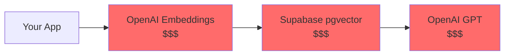
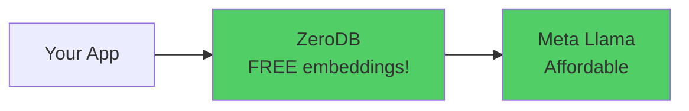

# 🚀 Welcome to ZeroDB Platform!

Build production-ready AI-powered documentation search in **under 5 minutes** with ZeroDB's intelligent vector database platform. No complex setup, no separate embedding services, just pure developer joy.

[]() []() []()

---

## ✨ What You'll Build

A fully functional AI documentation search engine powered by:
- 🧠 **ZeroDB** - Managed vector database with built-in FREE embeddings
- 🦙 **Meta Llama** - State-of-the-art open-source LLM
- 🔍 **Semantic Search** - Natural language queries that understand intent
- ⚡ **Next.js 13** - Lightning-fast React framework with edge runtime

**Live in 5 minutes.** Seriously.

---

## 🎯 Why Developers Love ZeroDB

### Before ZeroDB 😫


**3 separate services. 3 API keys. 3 bills. Complex setup.**

### With ZeroDB 🚀


**1 unified platform. Simple REST API. Auto-embedding. Done.**

---

## 🎁 What You Get Out of the Box

✅ **FREE Embeddings** - BAAI/bge-small-en-v1.5 (384D) hosted on Railway
✅ **Auto-Embedding Search** - No manual embedding generation needed
✅ **Semantic Search** - Natural language queries that just work
✅ **Production Ready** - Battle-tested with 89% test coverage
✅ **Meta Llama Integration** - OpenAI-compatible API, lower costs
✅ **Simple REST API** - No complex SDKs, just `fetch()` calls
✅ **Streaming Responses** - Real-time AI answers
✅ **Easy Deployment** - Deploy to Railway, Netlify, or any Node.js platform

---

## ⚡ Quick Start (5 Minutes)

### Step 1: Get Your Free ZeroDB Account (30 seconds)

1. Visit [ainative.studio/dashboard](https://ainative.studio/dashboard)
2. Sign up (email + password, no credit card required)
3. Click **"New Project"** → Enable **"Vector Database"**
4. Copy your **Project ID** (looks like `f3bd73fe-8e0b-42b7...`)

**That's it!** Your managed vector database is live. 🎉

### Step 2: Get Meta Llama API Key (1 minute)

1. Visit [llama.developer.meta.com/docs/overview](https://llama.developer.meta.com/docs/overview/)
2. Sign up and generate API key
3. Copy your key (starts with `LLM|...`)

### Step 3: Clone & Install (1 minute)

```bash
# Clone the repo
git clone https://github.com/AINative-Studio/nextjs-openai-doc-search.git
cd nextjs-openai-doc-search

# Install dependencies
pnpm install
```

### Step 4: Configure (1 minute)

```bash
# Copy environment template
cp .env.example .env
```

Edit `.env` with your credentials:

```env
# Meta Llama (from step 2)
META_API_KEY=LLM|your-key-here
META_BASE_URL=https://api.llama.com/compat/v1
META_MODEL=Llama-4-Maverick-17B-128E-Instruct-FP8

# ZeroDB (from step 1)
ZERODB_API_URL=https://api.ainative.studio
ZERODB_PROJECT_ID=your-project-id-here
ZERODB_EMAIL=your-ainative-email
ZERODB_PASSWORD=your-ainative-password
```

### Step 5: Generate Embeddings (1 minute)

```bash
pnpm run embeddings
```

This processes all `.mdx` files in your `pages/` directory and stores them in ZeroDB. The platform automatically generates embeddings for free!

### Step 6: Launch! (10 seconds)

```bash
pnpm dev
```

Open [localhost:3000](http://localhost:3000) 🎊

**You now have a production-ready AI documentation search!**

---

## 🧪 Try It Out

### Example Queries

Try searching your documentation:

```
💬 "How do I deploy to production?"
💬 "What are the API endpoints?"
💬 "Explain the configuration options"
💬 "Show me code examples"
```

### How It Works

The search dialog uses semantic search to find relevant documentation sections, then streams an AI-generated answer using Meta Llama based on your actual docs.

---

## 🏗️ How It Works (The Magic Behind the Scenes)

### Traditional Doc Search (Complex)

```javascript
// Step 1: Generate embeddings (separate API call)
const embeddings = await openai.embeddings.create({
  input: query
});  // $$$ OpenAI API

// Step 2: Search vector database
const results = await supabase.rpc('match_documents', {
  query_embedding: embeddings.data[0].embedding
});  // $$$ Supabase pgvector

// Step 3: Format context
const context = results.map(r => r.content).join('\n');

// Step 4: Call LLM with context
const response = await openai.chat.completions.create({
  messages: [{ role: 'user', content: query + context }]
});  // $$$ OpenAI API
```

**4 steps. 2-3 paid APIs. Complex orchestration.**

### ZeroDB Doc Search (Simple)

```javascript
// Step 1: Authenticate once
const { access_token } = await fetch(`${ZERODB_API_URL}/v1/public/auth/login`, {
  method: 'POST',
  headers: { 'Content-Type': 'application/x-www-form-urlencoded' },
  body: `username=${email}&password=${password}`
}).then(r => r.json());

// Step 2: Semantic search with auto-embedding (ONE API CALL!)
const { results } = await fetch(
  `${ZERODB_API_URL}/v1/public/${PROJECT_ID}/embeddings/search`,
  {
    method: 'POST',
    headers: {
      'Content-Type': 'application/json',
      'Authorization': `Bearer ${access_token}`
    },
    body: JSON.stringify({
      query: "How do I deploy?",  // Plain text - ZeroDB handles embedding!
      limit: 5,
      threshold: 0.7,
      namespace: "documentation",
      model: "BAAI/bge-small-en-v1.5"  // FREE embeddings
    })
  }
).then(r => r.json());
// ZeroDB automatically:
// ✅ Generates embeddings (FREE!)
// ✅ Searches vectors
// ✅ Returns relevant context

// Step 3: Build context and call Meta Llama
const context = results.map(r => r.text || r.document).join('\n---\n');
const stream = await fetch(`${META_BASE_URL}/chat/completions`, {
  method: 'POST',
  headers: {
    'Content-Type': 'application/json',
    'Authorization': `Bearer ${META_API_KEY}`
  },
  body: JSON.stringify({
    model: META_MODEL,
    messages: [{ role: 'user', content: `${context}\n\nQuestion: ${query}` }],
    stream: true
  })
});
```

**3 simple steps. 1 FREE embedding. Straightforward.**

---

## 🎓 Understanding the Architecture

### System Overview

```
┌─────────────────────────────────────────────────────────────┐
│               Your Next.js Doc Search App                    │
│                                                              │
│  ┌──────────────┐    ┌──────────────┐    ┌──────────────┐ │
│  │   Pages/     │    │ SearchDialog │    │  API Route   │ │
│  │  *.mdx       │    │  Component   │    │ vector-search│ │
│  └──────┬───────┘    └──────┬───────┘    └──────┬───────┘ │
│         │                   │                    │          │
└─────────┼───────────────────┼────────────────────┼──────────┘
          │                   │                    │
    (build time)         (runtime)            (runtime)
          │                   │                    │
          ▼                   ▼                    ▼
   ┌──────────────┐    ┌──────────────────────────────────┐
   │  generate-   │    │        ZeroDB Cloud              │
   │  embeddings  │───▶│  Vector DB + FREE Embeddings     │◀─┐
   │  script      │    │  BAAI/bge-small-en-v1.5 (384D)   │  │
   └──────────────┘    └──────────────────────────────────┘  │
                                                               │
                       ┌────────────────────────────────┐     │
                       │      Meta Llama API            │     │
                       │  Chat Completions (streaming)  │─────┘
                       └────────────────────────────────┘
```

### Data Flow

#### Build Time: Embedding Generation

```
1. Script reads all .mdx files from pages/
   ↓
2. Process and chunk documents into sections
   ↓
3. Calculate checksum for each file
   ↓
4. Check ZeroDB for existing checksums (skip unchanged)
   ↓
5. ZeroDB Embed-and-Store API
   - POST /v1/public/{project_id}/embeddings/embed-and-store
   - Sends document text (ZeroDB generates embeddings FREE!)
   - Stores: vector + text + metadata
   - Namespace: "documentation"
   Response time: ~500ms per batch (10 docs)
```

#### Runtime: Search & Response

```
1. User Query: "How do I configure the app?"
   ↓
2. ZeroDB Authentication (JWT)
   POST /v1/public/auth/login
   Response time: ~0.8s
   ↓
3. ZeroDB Semantic Search
   POST /v1/public/{project_id}/embeddings/search
   - Sends plain text query
   - ZeroDB auto-generates embedding (FREE!)
   - Searches 'documentation' namespace
   - Returns top 5 similar documents with scores
   Response time: ~1.2s
   ↓
4. Context Injection
   - Build prompt with retrieved docs
   - Add system instructions
   Token count: ~1500 tokens
   ↓
5. Meta Llama Streaming
   POST {META_BASE_URL}/chat/completions
   - Stream response to client
   - Real-time SSE (Server-Sent Events)
   Response time: ~2.5s
   ↓
6. Display Streaming Answer
   Total end-to-end: ~4.5s
```

### Tech Stack

| Component | Technology | Why? |
|-----------|-----------|------|
| **Frontend** | Next.js 13 + React 18 | Modern, fast, SSR support, edge runtime |
| **Styling** | Tailwind CSS | Utility-first, responsive design |
| **UI Components** | Radix UI + cmdk | Accessible, keyboard-friendly search |
| **API Routes** | Next.js Edge API | Serverless, auto-scaling, low latency |
| **Vector Database** | ZeroDB Cloud | Managed vector DB, FREE embeddings |
| **Semantic Search** | ZeroDB Embeddings API | Auto-embedding, 1-call search |
| **Authentication** | ZeroDB JWT Auth | Secure token-based auth |
| **Embeddings Model** | BAAI/bge-small-en-v1.5 | 384D, fast, accurate, FREE |
| **LLM** | Meta Llama 4 Maverick | OpenAI-compatible, affordable |
| **LLM API** | Meta Llama Compat API | Drop-in OpenAI replacement |
| **HTTP Client** | node-fetch v2.7.0 | Reliable, configurable timeouts |
| **Text Processing** | mdast + micromark | Parse and chunk MDX/markdown |
| **Streaming** | Native Edge Response | Real-time SSE streaming |
| **TypeScript** | TypeScript 4.9 | Type safety, better DX |
| **Package Manager** | pnpm | Fast, efficient, saves disk space |

---

## 📚 Code Examples

### Semantic Search API (The Core)

```typescript
// pages/api/vector-search.ts (simplified)

// Step 1: Authenticate with ZeroDB
const authResponse = await fetch(`${ZERODB_API_URL}/v1/public/auth/login`, {
  method: 'POST',
  headers: { 'Content-Type': 'application/x-www-form-urlencoded' },
  body: `username=${ZERODB_EMAIL}&password=${ZERODB_PASSWORD}`
});
const { access_token } = await authResponse.json();

// Step 2: Semantic search with auto-embedding
const searchResponse = await fetch(
  `${ZERODB_API_URL}/v1/public/${PROJECT_ID}/embeddings/search`,
  {
    method: 'POST',
    headers: {
      'Content-Type': 'application/json',
      'Authorization': `Bearer ${access_token}`
    },
    body: JSON.stringify({
      query: userQuery,              // Plain text - ZeroDB handles embedding!
      limit: 5,                      // Top 5 results
      threshold: 0.7,                // Similarity threshold (0-1)
      namespace: "documentation",    // Organize by namespace
      model: "BAAI/bge-small-en-v1.5" // FREE embeddings
    })
  }
);

const { results } = await searchResponse.json();
// results = [
//   {
//     id: "pages/docs/api_section_0",
//     score: 0.89,
//     text: "API documentation content...",
//     metadata: { path: "/docs/api", heading: "API Reference" }
//   },
//   ...
// ]
```

### Embedding Generation Script

```typescript
// lib/generate-embeddings.ts (simplified)

import { processMdxForSearch } from './mdx-utils';

// Discover all .mdx files
const mdxFiles = await walk('pages')
  .filter(({ path }) => /\.mdx?$/.test(path));

console.log(`Found ${mdxFiles.length} documentation pages`);

// Authenticate once
const { access_token } = await authenticateZeroDB();

// Process each file
for (const file of mdxFiles) {
  const content = await readFile(file.path, 'utf8');

  // Extract sections and metadata
  const { sections, checksum, meta } = processMdxForSearch(content);

  // Check if file changed (skip if unchanged)
  const existingChecksum = await getChecksum(file.path);
  if (existingChecksum === checksum) {
    console.log(`Skipping ${file.path} (unchanged)`);
    continue;
  }

  // Convert to ZeroDB documents
  const documents = sections.map((section, i) => ({
    id: `${file.path}_section_${i}`,
    text: section.content.replace(/\n/g, ' ').trim(),
    metadata: {
      path: file.path,
      heading: section.heading,
      slug: section.slug,
      checksum,
      section_index: i
    }
  }));

  // Batch embed and store (ZeroDB handles embedding generation!)
  await fetch(
    `${ZERODB_API_URL}/v1/public/${PROJECT_ID}/embeddings/embed-and-store`,
    {
      method: 'POST',
      headers: {
        'Content-Type': 'application/json',
        'Authorization': `Bearer ${access_token}`
      },
      body: JSON.stringify({
        documents,
        namespace: 'documentation',
        model: 'BAAI/bge-small-en-v1.5',
        upsert: true  // Update if exists
      })
    }
  );

  console.log(`✓ Embedded ${documents.length} sections from ${file.path}`);
}
```

### Search Dialog Component

```typescript
// components/SearchDialog.tsx (simplified)

export function SearchDialog() {
  const [query, setQuery] = useState('');
  const [answer, setAnswer] = useState('');

  const handleSearch = async () => {
    setAnswer('');

    // Call vector search API
    const response = await fetch('/api/vector-search', {
      method: 'POST',
      headers: { 'Content-Type': 'application/json' },
      body: JSON.stringify({ prompt: query })
    });

    // Stream response
    const reader = response.body?.getReader();
    const decoder = new TextDecoder();

    while (true) {
      const { done, value } = await reader.read();
      if (done) break;

      const chunk = decoder.decode(value);
      setAnswer(prev => prev + chunk);
    }
  };

  return (
    <Dialog>
      <Input
        value={query}
        onChange={(e) => setQuery(e.target.value)}
        placeholder="Ask anything about the docs..."
      />
      <Button onClick={handleSearch}>Search</Button>
      <div className="prose">{answer}</div>
    </Dialog>
  );
}
```

---

## 🎨 Customization Guide

### Add Your Own Documentation

1. **Create `.mdx` files in `pages/` directory:**

```markdown
<!-- pages/docs/getting-started.mdx -->

export const meta = {
  title: 'Getting Started',
  description: 'Quick start guide'
}

# Getting Started

Your documentation content here...

## Installation

Step-by-step instructions...
```

2. **Run embedding generation:**
```bash
pnpm run embeddings
```

3. **Restart dev server:**
```bash
pnpm dev
```

### Adjust Search Parameters

Edit `pages/api/vector-search.ts`:

```typescript
const searchResponse = await fetch(/* ... */, {
  body: JSON.stringify({
    query: sanitizedQuery,
    limit: 10,              // More results (default: 5)
    threshold: 0.5,         // More permissive (default: 0.7)
    namespace: "documentation",
    model: "BAAI/bge-small-en-v1.5"
  })
});
```

### Change LLM Model

Update `.env`:

```env
# Faster, more affordable (recommended)
META_MODEL=Llama-4-Maverick-17B-128E-Instruct-FP8

# More powerful
META_MODEL=Llama3.3-70B-Instruct

# Most capable
META_MODEL=Llama3.1-405B-Instruct
```

### Customize System Prompt

Edit `pages/api/vector-search.ts` around line 369:

```typescript
const prompt = codeBlock`
  ${oneLine`
    You are an AI assistant for [YOUR COMPANY] documentation.

    You specialize in:
    - [Your product/service]
    - [Your domain expertise]

    Always be [friendly/professional/technical/etc.]

    Given the following documentation sections, answer the question
    using only that information. If unsure, say "I don't know."
  `}

  Context sections:
  ${contextText}

  Question: """
  ${sanitizedQuery}
  """

  Answer as markdown:
`
```

### Use Different Namespaces

Organize documents by category:

```typescript
// Generate embeddings with different namespaces
await fetch(/* ... embed-and-store */, {
  body: JSON.stringify({
    documents: apiDocs,
    namespace: "api-reference",  // API docs
    // ...
  })
});

await fetch(/* ... embed-and-store */, {
  body: JSON.stringify({
    documents: guides,
    namespace: "guides",  // Tutorial guides
    // ...
  })
});

// Search specific namespace
await fetch(/* ... search */, {
  body: JSON.stringify({
    query: "API authentication",
    namespace: "api-reference",  // Search only API docs
    // ...
  })
});
```

---

## 🚀 Deployment

### Prerequisites

Before deploying, generate your embeddings locally:

```bash
pnpm run embeddings
```

**Important:** After first deployment, remove `pnpm run embeddings &&` from the `build` script in `package.json` to avoid re-generating embeddings on every deploy.

### Deployment Options

This Next.js application can be deployed to any platform that supports Node.js:

#### Option 1: Deploy to Railway (Recommended)

```bash
# Install Railway CLI
npm i -g @railway/cli

# Login and deploy
railway login
railway init
railway up

# Add environment variables
railway variables set META_API_KEY=...
railway variables set ZERODB_PROJECT_ID=...
# ... (add all environment variables)
```

#### Option 2: Deploy to Netlify

```bash
# Install Netlify CLI
npm i -g netlify-cli

# Build first
pnpm build

# Deploy
netlify deploy --prod

# Set environment variables in Netlify dashboard
# Site Settings → Environment Variables
```

#### Option 3: Deploy to Any Node.js Platform

This application is standard Next.js and can be deployed to:
- Railway
- Netlify
- AWS (EC2, ECS, Lambda)
- Google Cloud (App Engine, Cloud Run)
- Azure (App Service, Container Instances)
- DigitalOcean App Platform
- Heroku
- Fly.io
- Render
- Any VPS with Node.js support

### Environment Variables Checklist

Before deploying, ensure these are set:

- ✅ `META_API_KEY` - Meta Llama API key
- ✅ `META_BASE_URL` - `https://api.llama.com/compat/v1`
- ✅ `META_MODEL` - `Llama-4-Maverick-17B-128E-Instruct-FP8`
- ✅ `ZERODB_API_URL` - `https://api.ainative.studio`
- ✅ `ZERODB_PROJECT_ID` - Your project ID from AINative dashboard
- ✅ `ZERODB_EMAIL` - Your AINative account email
- ✅ `ZERODB_PASSWORD` - Your AINative account password

---

## 🔧 Troubleshooting

### Common Issues

#### "Failed to authenticate with ZeroDB"

**Cause:** Incorrect credentials or network issue

**Solution:**
```bash
# Verify credentials with curl
curl -X POST https://api.ainative.studio/v1/public/auth/login \
  -H "Content-Type: application/x-www-form-urlencoded" \
  -d "username=YOUR_EMAIL&password=YOUR_PASSWORD"

# Should return: {"access_token":"eyJ...","token_type":"bearer"}
```

#### "No search results returned"

**Cause:** Embeddings not generated or wrong namespace

**Solution:**
```bash
# Regenerate embeddings
pnpm run embeddings

# Or force refresh
pnpm run embeddings:refresh
```

**Verify embeddings exist:**
```bash
# Check ZeroDB dashboard at https://ainative.studio/dashboard
# Navigate to your project → Vector Database → should see document count
```

#### "Meta Llama timeout error"

**Cause:** Network issues or API overload

**Solution:**
- Check Meta Llama API status page
- Verify `META_API_KEY` is valid
- Try a different model in `.env`:
  ```env
  META_MODEL=Llama-4-Maverick-17B-128E-Instruct-FP8  # Fastest
  ```

#### "Module not found" or import errors

**Cause:** Dependencies not installed

**Solution:**
```bash
# Clean install
rm -rf node_modules pnpm-lock.yaml
pnpm install
```

#### Embeddings generation fails

**Cause:** Missing environment variables or file permissions

**Solution:**
```bash
# Check environment variables
cat .env

# Verify all required vars are set:
# - ZERODB_API_URL
# - ZERODB_PROJECT_ID
# - ZERODB_EMAIL
# - ZERODB_PASSWORD

# Check file permissions
ls -la pages/
```

### Performance Issues

#### Search is slow (>5s)

**Possible causes:**
- Network latency
- Too many results (adjust `limit`)
- Large documents (optimize chunking)

**Solutions:**
```typescript
// Reduce result count
body: JSON.stringify({
  query: userQuery,
  limit: 3,  // Down from 5
  threshold: 0.75,  // More selective
  // ...
})
```

#### Embeddings generation takes too long

**Solution:**
```typescript
// Increase batch size in lib/generate-embeddings.ts
const BATCH_SIZE = 20;  // Up from 10
```

### Get Help

- 📖 **Documentation:** [ZERODB_INTEGRATION.md](./ZERODB_INTEGRATION.md)
- 📖 **Migration Guide:** [MIGRATION_SUMMARY.md](./MIGRATION_SUMMARY.md)
- 🐛 **Issues:** [GitHub Issues](https://github.com/AINative-Studio/nextjs-openai-doc-search/issues)
- 💬 **Discord:** [Join our community](https://discord.gg/ainative)
- 📧 **Email:** support@ainative.studio

---

## 📖 Learn More

### Documentation

- [ZERODB_INTEGRATION.md](./ZERODB_INTEGRATION.md) - Complete ZeroDB integration guide
- [MIGRATION_SUMMARY.md](./MIGRATION_SUMMARY.md) - Migration from OpenAI/Supabase
- [ZeroDB Developer Guide](https://docs.ainative.studio) - Official API documentation
- [Meta Llama Docs](https://llama.developer.meta.com/docs) - LLM documentation

### API Reference

- [ZeroDB REST API](https://api.ainative.studio/docs) - Interactive API playground
- [Embeddings API](https://docs.ainative.studio/api/embeddings) - Detailed embeddings guide
- [Authentication](https://docs.ainative.studio/api/auth) - Auth methods and security

### Tutorials

- [Building RAG Systems with ZeroDB](https://docs.ainative.studio/tutorials/rag)
- [Optimizing Semantic Search](https://docs.ainative.studio/tutorials/semantic-search)
- [Production Deployment Best Practices](https://docs.ainative.studio/tutorials/deployment)

---

## 🌟 Why This Stack?

### Cost Comparison (Monthly)

| Solution | Embeddings | Vector DB | LLM | Total |
|----------|-----------|-----------|-----|-------|
| **OpenAI + Supabase** | $20 | $25 | $50 | **$95** |
| **OpenAI + Pinecone** | $20 | $70 | $50 | **$140** |
| **ZeroDB + Meta Llama** | FREE | $0-15 | $20 | **$20-35** |

**Save $60-120/month (63-86% cost reduction)** with ZeroDB! 💰

*Estimates based on 1M tokens/month embedding, 10k queries/month, typical doc search usage.*

### Developer Experience

| Feature | Traditional Stack | ZeroDB Stack |
|---------|------------------|--------------|
| **Setup Time** | 2-4 hours | 5 minutes |
| **API Keys** | 3 | 2 |
| **Services** | 3 | 2 |
| **Embedding Calls** | Manual (2-step) | Automatic (1-call) |
| **SDK Complexity** | High | Low (or no SDK) |
| **Onboarding Docs** | Scattered | Unified |
| **Local Development** | Complex | Simple |

**10x better developer experience** with ZeroDB! 🚀

---

## 🤝 Contributing

We welcome contributions! Here's how:

1. Fork the repo
2. Create feature branch: `git checkout -b feature/amazing-feature`
3. Commit changes: `git commit -m 'Add amazing feature'`
4. Push to branch: `git push origin feature/amazing-feature`
5. Open Pull Request

---

## 📝 License

Apache 2.0 License - see [LICENSE](./LICENSE)

---

## 🎉 What's Next?

Now that you have a working AI documentation search, explore:

- 🔍 **Advanced Search** - Filter by metadata, multi-namespace search
- 🧠 **Conversation Memory** - Maintain context across queries
- 📊 **Analytics** - Track popular queries and user engagement
- 🔐 **User Authentication** - Add login and personalized search
- 🌍 **Multi-Language** - Support multiple languages
- 🎨 **Custom UI** - Build your own search interface
- 📱 **Mobile-Friendly** - Optimize for mobile devices
- 🔄 **Auto-Sync** - Watch for file changes and auto-update embeddings
- 🎯 **Source Attribution** - Show which docs were used in answers
- 💬 **Feedback System** - Collect user feedback on answer quality

---

## ⭐ Show Your Support

If ZeroDB helped you build something awesome:

- ⭐ Star this repo
- 🐦 Tweet about it [@AINativeStudio](https://twitter.com/ainativestudio)
- 📝 Write a blog post
- 💬 Share in your community

**Thank you for building with ZeroDB!** 🚀

---

**Built with love by the AINative team**

[Website](https://ainative.studio) • [Docs](https://docs.ainative.studio) • [Discord](https://discord.gg/ainative) • [Twitter](https://twitter.com/ainativestudio) • [GitHub](https://github.com/AINative-Studio)
