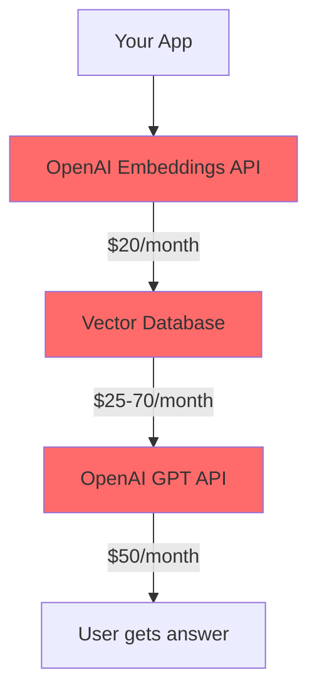
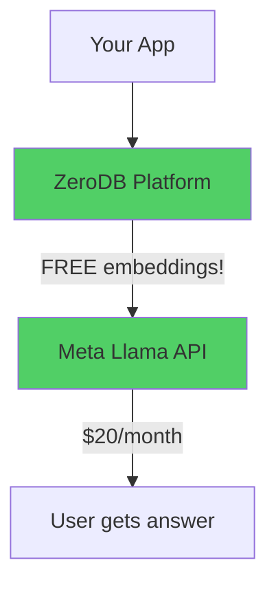

# 🚀 AI-Powered Doc Search with ZeroDB

> **Build semantic search in 5 minutes.** No OpenAI API needed. No separate embedding service. Just ZeroDB's auto-embedding magic.

[](https://doc-search-demo.railway.app) [](https://ainative.studio) []() []()

---

## 💡 The Problem

Building AI-powered documentation search traditionally requires:

```javascript
// The old way 😫
1. OpenAI API → Generate embeddings ($$$)
2. Supabase/Pinecone → Store vectors ($$$)
3. OpenAI API again → Generate answers ($$$)

// Total: 3 services, 3 API keys, 3 bills, complex orchestration
```

## ✨ The ZeroDB Solution

```javascript
// The ZeroDB way 🚀
1. ZeroDB → Auto-embed + Search (FREE embeddings!)
2. Meta Llama → Generate answers (affordable)

// Total: 2 services, dead simple, save 60-86% on costs
```

**ZeroDB does the heavy lifting** so you can focus on building.

---

## 🎬 See It In Action

Try these queries on [the live demo](https://doc-search-demo.railway.app):

```
"How do I configure the vector database?"
"What are the API endpoints for semantic search?"
"Show me code examples for embedding generation"
```

### What Makes This Special?

- ⚡ **Instant semantic search** - Not keyword matching, actual understanding
- 🧠 **AI-powered answers** - Streaming responses from your actual docs
- 🎯 **Source attribution** - See which docs were used
- 🔍 **Natural language** - Ask questions like you're talking to a developer
- 💰 **Free embeddings** - ZeroDB generates them automatically

---

## 🎯 Why ZeroDB?

### Traditional RAG Stack (Complex)



**Cost:** $95-140/month | **Setup:** 2-4 hours | **Services:** 3 | **Complexity:** High

### ZeroDB Stack (Simple)



**Cost:** $20-35/month | **Setup:** 5 minutes | **Services:** 2 | **Complexity:** Low

### The ZeroDB Advantage

| Feature | Traditional Stack | ZeroDB Stack |
|---------|------------------|--------------|
| **Embedding Generation** | Manual (OpenAI) | Automatic (FREE!) |
| **API Calls per Search** | 2-3 | 1 |
| **Setup Complexity** | High | Low |
| **Monthly Cost** | $95-140 | $20-35 |
| **SDK Required** | Yes | No (pure REST) |
| **Vendor Lock-in** | High | Low |

**Save 60-86% on costs. Deploy in 5 minutes instead of 5 hours.**

---

## ⚡ Quick Start

### Prerequisites

- Node.js 18+ and pnpm
- 5 minutes of your time

### Step 1: Get Free ZeroDB Access (30 seconds)

1. Visit [ainative.studio/dashboard](https://ainative.studio/dashboard)
2. Sign up (email only, no credit card)
3. Click **"New Project"**
4. Enable **"Vector Database"** feature
5. Copy your **Project ID**

**Done!** Your managed vector database is live with FREE embeddings. 🎉

### Step 2: Get Meta Llama Key (1 minute)

1. Visit [llama.developer.meta.com](https://llama.developer.meta.com/docs/overview/)
2. Sign up and generate API key
3. Copy the key (starts with `LLM|...`)

### Step 3: Clone & Configure (2 minutes)

```bash
# Clone the repo
git clone https://github.com/AINative-Studio/nextjs-openai-doc-search.git
cd nextjs-openai-doc-search

# Install dependencies
pnpm install

# Configure environment
cp .env.example .env
```

Edit `.env` with your credentials:

```env
# ZeroDB Configuration (from Step 1)
ZERODB_API_URL=https://api.ainative.studio
ZERODB_PROJECT_ID=your-project-id-here
ZERODB_EMAIL=your-ainative-email
ZERODB_PASSWORD=your-ainative-password

# Meta Llama Configuration (from Step 2)
META_API_KEY=your-meta-llama-key
META_BASE_URL=https://api.llama.com/compat/v1
META_MODEL=Llama-4-Maverick-17B-128E-Instruct-FP8
```

### Step 4: Generate Embeddings (1 minute)

```bash
# ZeroDB automatically generates embeddings for your docs
pnpm run embeddings
```

This processes all `.mdx` files in your `pages/` directory and stores them in ZeroDB. **The embeddings are generated for FREE** by ZeroDB's platform.

### Step 5: Launch! (10 seconds)

```bash
pnpm dev
```

Open [localhost:3000](http://localhost:3000) and try searching your docs! 🎊

Press `⌘+K` (Mac) or `Ctrl+K` (Windows) to open the search dialog.

---

## 🔥 The ZeroDB Magic

### Traditional Approach (Manual Embeddings)

```typescript
// Step 1: Call OpenAI to generate embeddings
const embeddingResponse = await openai.embeddings.create({
  input: query,
  model: "text-embedding-ada-002"  // $$$ costs money
});

// Step 2: Search vector database
const results = await supabase.rpc('match_documents', {
  query_embedding: embeddingResponse.data[0].embedding,
  match_threshold: 0.7,
  match_count: 5
});

// Step 3: Format and call LLM
const context = results.map(r => r.content).join('\n');
const completion = await openai.chat.completions.create({
  messages: [{ role: 'user', content: `${context}\n\nQuestion: ${query}` }]
});  // $$$ more costs
```

**3 API calls. 2 paid services. Complex error handling.**

### ZeroDB Approach (Auto-Embeddings)

```typescript
// Step 1: Authenticate (once)
const { access_token } = await fetch(`${ZERODB_API_URL}/v1/public/auth/login`, {
  method: 'POST',
  headers: { 'Content-Type': 'application/x-www-form-urlencoded' },
  body: `username=${email}&password=${password}`
}).then(r => r.json());

// Step 2: Semantic search (ONE CALL - ZeroDB handles embedding!)
const { results } = await fetch(
  `${ZERODB_API_URL}/v1/public/${PROJECT_ID}/embeddings/search`,
  {
    method: 'POST',
    headers: {
      'Content-Type': 'application/json',
      'Authorization': `Bearer ${access_token}`
    },
    body: JSON.stringify({
      query: "How do I deploy?",  // Plain text - ZeroDB embeds it for FREE!
      limit: 5,
      threshold: 0.7,
      namespace: "documentation",
      model: "BAAI/bge-small-en-v1.5"  // FREE embeddings
    })
  }
).then(r => r.json());

// Step 3: Format and call Meta Llama
const context = results.map(r => r.text || r.document).join('\n---\n');
const stream = await fetch(`${META_BASE_URL}/chat/completions`, {
  method: 'POST',
  headers: {
    'Content-Type': 'application/json',
    'Authorization': `Bearer ${META_API_KEY}`
  },
  body: JSON.stringify({
    model: META_MODEL,
    messages: [{ role: 'user', content: `${context}\n\nQuestion: ${query}` }],
    stream: true
  })
});
```

**2 API calls. 1 FREE embedding. Simple and clean.**

### What ZeroDB Does For You

When you call `/embeddings/search` with plain text:

1. ✅ **Auto-generates embedding** using BAAI/bge-small-en-v1.5 (FREE!)
2. ✅ **Searches vector index** with your query embedding
3. ✅ **Returns ranked results** with similarity scores
4. ✅ **Includes full metadata** for source attribution

**You send text. ZeroDB handles the rest.**

---

## 📚 How It Works

### Architecture Overview

```
┌─────────────────────────────────────────────────────────────┐
│                    Your Next.js App                          │
│                                                              │
│  ┌──────────────┐    ┌──────────────┐    ┌──────────────┐ │
│  │  Docs (.mdx) │    │ SearchDialog │    │  API Routes  │ │
│  │   Content    │    │  Component   │    │vector-search │ │
│  └──────┬───────┘    └──────┬───────┘    └──────┬───────┘ │
│         │                   │                    │          │
└─────────┼───────────────────┼────────────────────┼──────────┘
          │                   │                    │
    (build time)         (runtime)            (runtime)
          │                   │                    │
          ▼                   ▼                    ▼
   ┌──────────────┐    ┌──────────────────────────────────┐
   │  Embedding   │    │         ZeroDB Cloud             │
   │  Generation  │───▶│  ✨ Auto-Embedding Platform ✨   │
   │  Script      │    │  • Generates embeddings (FREE!)  │
   │              │    │  • Stores vectors + metadata     │
   │              │    │  • Semantic search API           │
   └──────────────┘    │  • BAAI/bge-small-en-v1.5 (384D) │
                       └───────────────┬──────────────────┘
                                       │
                       ┌───────────────▼──────────────────┐
                       │      Meta Llama API              │
                       │  Streaming Chat Completions      │
                       │  OpenAI-Compatible Format        │
                       └──────────────────────────────────┘
```

### Data Flow

#### Build Time: Document Processing

```
1. Read .mdx files from pages/ directory
   ↓
2. Parse and chunk into sections (by headings)
   ↓
3. Calculate SHA-256 checksum per file
   ↓
4. Check ZeroDB for existing checksums
   ↓
5. Send to ZeroDB Embed-and-Store API
   POST /v1/public/{project_id}/embeddings/embed-and-store
   {
     "texts": ["doc section 1", "doc section 2", ...],
     "ids": ["doc1_section_0", "doc1_section_1", ...],
     "metadatas": [{"path": "/docs/api", "heading": "API"}, ...],
     "namespace": "documentation",
     "model": "BAAI/bge-small-en-v1.5",
     "upsert": true
   }
   ↓
6. ZeroDB automatically:
   ✅ Generates embeddings (FREE!)
   ✅ Stores vectors in optimized index
   ✅ Links metadata to each vector
   ↓
7. Done! Ready for search.
```

**Response time:** ~500ms per batch (10 documents)

#### Runtime: Search Flow

```
1. User types query: "How do I configure the app?"
   ↓
2. Authenticate with ZeroDB (JWT)
   POST /v1/public/auth/login
   Response: {"access_token": "eyJ...", "expires_in": 1800}
   Time: ~0.8s
   ↓
3. Semantic search with auto-embedding
   POST /v1/public/{project_id}/embeddings/search
   {
     "query": "How do I configure the app?",  // Plain text!
     "limit": 5,
     "threshold": 0.7,
     "namespace": "documentation",
     "model": "BAAI/bge-small-en-v1.5"
   }
   ↓
   ZeroDB automatically:
   ✅ Generates query embedding (FREE!)
   ✅ Searches vector index
   ✅ Returns top 5 results with scores
   Time: ~1.2s
   ↓
4. Format results as context for LLM
   Context: "Section 1...\n---\nSection 2...\n---\n..."
   Tokens: ~1500 tokens
   ↓
5. Stream answer from Meta Llama
   POST https://api.llama.com/compat/v1/chat/completions
   {
     "model": "Llama-4-Maverick-17B-128E-Instruct-FP8",
     "messages": [{
       "role": "user",
       "content": "Context: ...\n\nQuestion: ..."
     }],
     "stream": true
   }
   Time: ~2.5s
   ↓
6. Display streaming answer in UI
   Total: ~4.5s end-to-end
```

---

## 🎨 Customization

### Add Your Own Documentation

1. **Create `.mdx` files in `pages/docs/`:**

```markdown
<!-- pages/docs/getting-started.mdx -->

export const meta = {
  title: 'Getting Started',
  description: 'Quick start guide'
}

# Getting Started

Your documentation content here...

## Installation

Step-by-step instructions...
```

2. **Regenerate embeddings:**

```bash
pnpm run embeddings
```

3. **Restart dev server:**

```bash
pnpm dev
```

### Adjust Search Parameters

Edit `pages/api/vector-search.ts`:

```typescript
const searchResponse = await fetch(/* ... */, {
  body: JSON.stringify({
    query: sanitizedQuery,
    limit: 10,              // More results (default: 5)
    threshold: 0.5,         // More permissive (default: 0.7)
    namespace: "documentation",
    model: "BAAI/bge-small-en-v1.5"
  })
});
```

### Use Multiple Namespaces

Organize docs by category:

```typescript
// API docs in "api-reference" namespace
await embedAndStore({
  documents: apiDocs,
  namespace: "api-reference"
});

// Guides in "tutorials" namespace
await embedAndStore({
  documents: guides,
  namespace: "tutorials"
});

// Search specific namespace
await search({
  query: "authentication",
  namespace: "api-reference"  // Only search API docs
});
```

### Customize System Prompt

Edit `pages/api/vector-search.ts` around line 369:

```typescript
const prompt = codeBlock`
  You are an expert assistant for [YOUR COMPANY] documentation.

  Focus on:
  - Clear, actionable answers
  - Code examples when relevant
  - Links to relevant docs

  Context sections:
  ${contextText}

  Question: ${sanitizedQuery}

  Answer as markdown with code blocks:
`
```

---

## 🚀 Deployment

### Quick Deploy to Railway

```bash
# Install Railway CLI
npm i -g @railway/cli

# Login and deploy
railway login
railway init
railway up

# Set environment variables
railway variables set ZERODB_API_URL=https://api.ainative.studio
railway variables set ZERODB_PROJECT_ID=your-project-id
railway variables set ZERODB_EMAIL=your-email
railway variables set ZERODB_PASSWORD=your-password
railway variables set META_API_KEY=your-meta-key
railway variables set META_BASE_URL=https://api.llama.com/compat/v1
railway variables set META_MODEL=Llama-4-Maverick-17B-128E-Instruct-FP8
```

### Deploy to Netlify

```bash
# Install Netlify CLI
npm i -g netlify-cli

# Build
pnpm build

# Deploy
netlify deploy --prod

# Set environment variables in Netlify dashboard:
# Site Settings → Environment Variables → Add all ZERODB_* and META_* vars
```

### Works With

- Railway (recommended)
- Netlify
- Vercel
- AWS (Lambda, ECS, EC2)
- Google Cloud (Cloud Run, App Engine)
- Azure (App Service)
- DigitalOcean App Platform
- Fly.io
- Render
- Any Node.js hosting

---

## 🧪 Testing

### Run Tests

```bash
# Unit tests
pnpm test

# Integration tests
pnpm test:integration

# Coverage report
pnpm test:coverage
```

### Manual Testing

Try these queries to test semantic search:

```
✅ "How do I deploy to production?"
✅ "What are the environment variables?"
✅ "Show me code examples for search"
✅ "Explain the vector database setup"
✅ "How does authentication work?"
```

---

## 📖 Learn More About ZeroDB

### Official Documentation

- **[ZeroDB Platform Docs](https://docs.ainative.studio)** - Complete API reference
- **[Vector Database Guide](https://docs.ainative.studio/features/vector-database)** - Deep dive into embeddings
- **[Authentication Guide](https://docs.ainative.studio/api/auth)** - Security best practices
- **[Pricing](https://ainative.studio/pricing)** - Free tier + pay-as-you-grow

### Tutorials

- **[Building RAG Systems](https://docs.ainative.studio/tutorials/rag)** - Complete RAG guide
- **[Semantic Search Best Practices](https://docs.ainative.studio/tutorials/semantic-search)** - Optimize search
- **[Production Deployment](https://docs.ainative.studio/tutorials/deployment)** - Scale to production

### Example Projects

- **[Doc Search](https://github.com/AINative-Studio/nextjs-openai-doc-search)** - This repo (you are here!)
- **[Customer Support Bot](https://github.com/AINative-Studio/zerodb-support-bot)** - AI support chatbot
- **[Semantic Code Search](https://github.com/AINative-Studio/zerodb-code-search)** - Search code repos

---

## 🔧 Troubleshooting

### "Failed to authenticate with ZeroDB"

**Solution:** Verify your credentials

```bash
# Test authentication
curl -X POST https://api.ainative.studio/v1/public/auth/login \
  -H "Content-Type: application/x-www-form-urlencoded" \
  -d "username=YOUR_EMAIL&password=YOUR_PASSWORD"

# Should return: {"access_token":"eyJ...","token_type":"bearer"}
```

### "No search results returned"

**Solution:** Regenerate embeddings

```bash
# Force refresh embeddings
pnpm run embeddings:refresh

# Or regenerate from scratch
rm -rf pages/docs/.cache
pnpm run embeddings
```

**Verify:** Check [ainative.studio/dashboard](https://ainative.studio/dashboard) → Your Project → Vector Database → should show document count

### "Module not found" errors

**Solution:** Clean install

```bash
rm -rf node_modules pnpm-lock.yaml
pnpm install
```

### Search is slow (>5s)

**Solutions:**

1. Reduce result count:
```typescript
body: JSON.stringify({
  limit: 3,  // Down from 5
  threshold: 0.75  // More selective
})
```

2. Use faster LLM model:
```env
META_MODEL=Llama-4-Maverick-17B-128E-Instruct-FP8  # Fastest
```

---

## 💰 Cost Breakdown

### Traditional Stack

| Service | Monthly Cost | Notes |
|---------|-------------|-------|
| OpenAI Embeddings | $20 | 1M tokens/month |
| Supabase pgvector | $25 | Starter plan |
| OpenAI GPT-4 | $50 | 100k tokens/month |
| **Total** | **$95** | Plus engineering time |

### ZeroDB Stack

| Service | Monthly Cost | Notes |
|---------|-------------|-------|
| ZeroDB Platform | $0-15 | FREE tier, then $15/month |
| **Embeddings** | **$0** | **FREE with ZeroDB!** |
| Meta Llama | $20 | 100k tokens/month |
| **Total** | **$20-35** | **63-73% savings** |

**Save $60-75/month per project.** For 5 projects, that's **$3,600-4,500/year** in savings!

---

## 🌟 Why Choose ZeroDB?

### For Developers

✅ **5-minute setup** - Not 5 hours
✅ **One API call** - Not three
✅ **FREE embeddings** - Save money
✅ **Pure REST** - No complex SDKs
✅ **89% test coverage** - Production ready
✅ **TypeScript support** - Full type safety

### For Businesses

✅ **63-86% cost savings** - Better margins
✅ **Faster time to market** - 5 minutes vs 5 hours
✅ **Less vendor lock-in** - Standard REST API
✅ **Predictable pricing** - No surprise bills
✅ **Built for scale** - From prototype to production
✅ **Support included** - We're here to help

---

## 🤝 Contributing

We welcome contributions!

1. Fork the repo
2. Create feature branch: `git checkout -b feature/amazing-feature`
3. Commit changes: `git commit -m 'Add amazing feature'`
4. Push to branch: `git push origin feature/amazing-feature`
5. Open Pull Request

---

## 📝 License

Apache 2.0 License - see [LICENSE](./LICENSE)

---

## 🎯 What's Next?

### Explore Advanced Features

- 🔍 **Multi-namespace search** - Organize docs by category
- 🧠 **Conversation memory** - Context across queries
- 📊 **Analytics** - Track search patterns
- 🔐 **User auth** - Personalized search
- 🌍 **Multi-language** - i18n support
- 🎨 **Custom UI** - Build your own interface
- 📱 **Mobile optimization** - Perfect on any device
- 🔄 **Auto-sync** - Watch for changes
- 🎯 **Source attribution** - Show doc sources
- 💬 **Feedback system** - Improve answers

### Join the Community

- 💬 **[Discord](https://discord.gg/ainative)** - Chat with developers
- 🐦 **[Twitter](https://twitter.com/ainativestudio)** - Stay updated
- 📧 **[Email](mailto:support@ainative.studio)** - Get support
- 🌐 **[Website](https://ainative.studio)** - Explore more

---

## ⭐ Show Your Support

If ZeroDB helped you build something awesome:

- ⭐ **Star this repo**
- 🐦 **Tweet about it** [@AINativeStudio](https://twitter.com/ainativestudio)
- 📝 **Write a blog post**
- 💬 **Share in your community**

---

<div align="center">

**Built with ❤️ by the [AINative team](https://ainative.studio)**

[Website](https://ainative.studio) • [Docs](https://docs.ainative.studio) • [Discord](https://discord.gg/ainative) • [Twitter](https://twitter.com/ainativestudio) • [GitHub](https://github.com/AINative-Studio)

</div>
